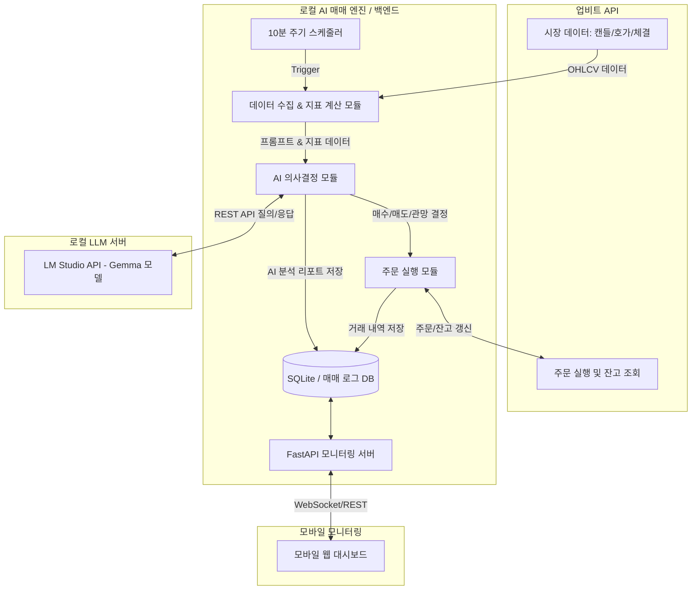

# XRP AI Trading & Monitoring System (SKILL.md)

> **프로젝트명**: XRP 로컬 AI 자동 매매 및 실시간 모바일 모니터링 시스템  
> **목표**: 업비트 API와 로컬 LLM(LM Studio + Gemma 모델)을 결합하여 10분 주기로 XRP(리플) 데이터를 분석하고 자동 매매를 수행하여 수익을 창출하며, 모바일 웹을 통해 실시간 자산 현황과 AI 판단 근거를 완벽하게 모니터링합니다.

---

## 1. 시스템 아키텍처 (System Architecture)

본 시스템은 **Python 백엔드(자동 매매 엔진 + API 서버)**와 **모바일 최적화 웹 프론트엔드(대시보드)**로 구성됩니다.



---

## 2. 핵심 모듈 구성 및 기능

### 2.1. 데이터 수집 및 기술적 지표 모듈 (Data Collector)
- **업비트 Open API 활용**: `pyupbit` 라이브러리 또는 직접 REST API 호출을 통해 KRW-XRP 시장 데이터 수집.
- **수집 주기**: 매 10분마다 최근 캔들(1분봉, 10분봉, 1시간봉) 및 호가창(Orderbook), 거래량 데이터 수집.
- **기술적 지표 계산**:
  - **RSI (Relative Strength Index)**: 과매수/과매도 판단.
  - **MACD / 볼린저 밴드 (Bollinger Bands)**: 추세 및 변동성 분석.
  - **이동평균선 (MA)**: 단기/중기 이동평균선 배열 상태 확인.

### 2.2. AI 분석 및 의사결정 모듈 (AI Brain - Gemma 연동)
- **LM Studio API 연동**: 로컬호스트(`http://localhost:1234/v1/chat/completions`)에 띄워진 Gemma 모델과 통신.
- **체계적인 프롬프트 엔지니어링**:
  - **System Prompt**: *"당신은 세계 최고의 암호화폐 트레이딩 전문가이자 퀀트 분석가입니다. 차트 지표와 현재 시장 상황을 바탕으로 리스크를 최소화하고 수익을 극대화하는 결정을 내려야 합니다."*
  - **User Prompt**: 현재 시점의 가격, 지표(RSI, MACD 등), 보유 잔고(XRP 및 KRW), 최근 매매 포지션을 JSON 또는 명확한 텍스트 구조로 전달.
- **출력 제약 (Structured Output)**: AI의 응답을 파싱하기 쉽도록 JSON 형태로 반환 유도.
  ```json
  {
    "decision": "BUY", // BUY, SELL, HOLD
    "reason": "RSI가 30 이하로 과매도 구간이며, 10분봉 기준 MACD 골든크로스가 발생하여 단기 반등이 예상됨.",
    "confidence": 0.85,
    "percentage": 50 // 가용 자산 중 매수/매도할 비중 (%)
  }
  ```

### 2.3. 주문 실행 및 자산 관리 모듈 (Order Executor)
- **안전한 API 인증**: 발급받은 Access Key 및 Secret Key를 사용해 JWT 토큰 생성 후 안전하게 주문 요청.
- **자산 보호 및 분할 매매 로직**:
  - 현재 보유 자산(10만원 상당의 XRP 및 잔여 KRW)을 기반으로 올인(All-in) 매매를 지양하고 분할 매수/매도 로직 적용.
  - 슬리피지 방지를 위한 시장가/지정가 최적화 로직.

### 2.4. 실시간 모니터링 백엔드 및 모바일 웹 (Monitoring Web)
- **백엔드 (FastAPI)**: 경량 및 고성능 비동기 웹서버. AI 판단 로그, 현재 잔고, 수익률, 차트 데이터를 제공하는 REST API 및 실시간 알림용 WebSocket 제공.
- **프론트엔드 (React / Vite + 모던 UI)**:
  - **Premium Dark Mode UI**: 유리 질감(Glassmorphism), 부드러운 애니메이션, 모던 타이포그래피 적용.
  - **핵심 화면**:
    1. **내 자산 현황**: 총 보유 자산, 실시간 수익률, 보유 KRW 및 XRP 수량.
    2. **AI 실시간 리포트**: 최근 10분 주기의 AI 판단 결과(결정, 확신도, 상세 이유) 카드 뷰.
    3. **매매 히스토리**: 체결 내역 타임라인.
    4. **차트 뷰**: XRP 현재가 및 지표 간이 차트.

---

## 3. 보안 및 환경변수 설정 (Security & Configuration)

**절대 API 키를 코드에 직접 입력(하드코딩)하지 않습니다.**  
프로젝트 루트에 `.env` 파일을 생성하고 아래와 같이 관리합니다. 백엔드는 `python-dotenv`를 사용하여 이를 로드합니다.

```ini
# .env 파일 구조 예시 (Git 저장소 제외 필수)
UPBIT_ACCESS_KEY=Um2Z4NpNinWmxgVezGr9rV9WPX7oyuOl0mLxPCYk
UPBIT_SECRET_KEY=GSABQZsZDoghRsEiOPMV359KfxbYxUWdx7xMN3c2
LM_STUDIO_BASE_URL=http://localhost:1234/v1
TRADING_INTERVAL_MINUTES=10
MAX_INVESTMENT_KRW=100000
```

---

## 4. 단계별 구현 계획 (Implementation Roadmap)

- **Phase 1: 백엔드 기본 구조 및 데이터 수집 구축**
  - Python 가상환경 설정 및 의존성 라이브러리 설치 (`pyupbit`, `requests`, `fastapi`, `uvicorn`, `python-dotenv`, `pandas`).
  - 업비트 잔고 조회 및 10분 주기 데이터 수집 파이프라인 검증.
- **Phase 2: 로컬 AI (LM Studio/Gemma) 연동 및 프롬프트 튜닝**
  - 지표 데이터를 포맷팅하여 LM Studio API로 질의하는 로직 작성.
  - 응답 파싱 및 예외 처리(AI가 엉뚱한 대답을 할 경우 기본값 `HOLD` 처리).
- **Phase 3: 매매 실행 엔진 및 스케줄러 통합**
  - 매매 로직 연동 및 가상 테스트(또는 소액 테스트).
  - 매매 내역 및 로그를 로컬 DB(`trading_log.db`)에 기록.
- **Phase 4: 모바일 모니터링 웹앱 구축**
  - FastAPI 기반 API 엔드포인트 개설.
  - React + Vanilla CSS(또는 모던 프레임워크)를 활용한 프리미엄 모바일 UI 개발.
  - 모바일 기기 접속 환경 구성(로컬 IP 접속 지원).
