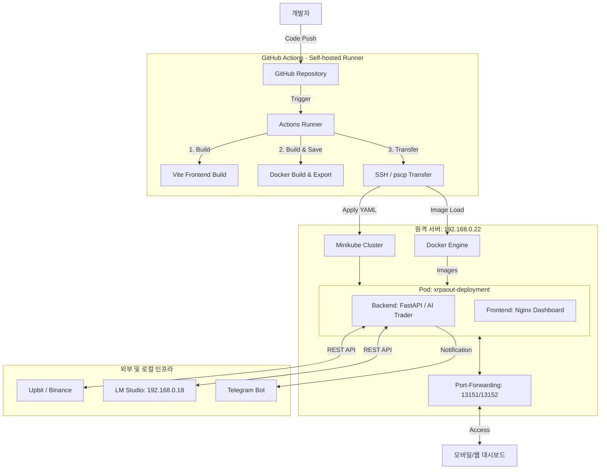

# XRP AI Trading & Monitoring System (SKILL.md)

> **프로젝트명**: XRP 로컬 AI 자동 매매 및 실시간 모바일 모니터링 시스템  
> **목표**: 업비트/바이낸스 API와 로컬 LLM(LM Studio + Gemma 모델)을 결합하여 자동 매매를 수행하고, GitHub Actions와 Kubernetes(K8s)를 통해 원격 서버에 자동 배포 및 실시간 모니터링을 제공합니다.

---

## 1. 시스템 아키텍처 (System Architecture)

본 시스템은 **CI/CD 파이프라인**, **원격 쿠버네티스 서버**, 그리고 **로컬 LLM 인프라**가 유기적으로 연결된 현대적인 클라우드-네이티브 구조를 따릅니다.



---

## 2. 핵심 모듈 및 자동 배포 (CI/CD)

### 2.1. 자동 배포 파이프라인 (GitHub Actions)
- **Self-hosted Runner**: 개발 PC(`192.168.0.18`)에서 동작하는 러너를 통해 내부망 서버에 직접 접근.
- **빌드 및 이미지 전송**:
  - `Vite`를 사용한 프론트엔드 최적화 빌드.
  - `Docker` 이미지를 빌드하고 TAR 파일로 내보낸 후 `pscp`를 통해 원격 서버로 보안 전송.
- **원격 오케스트레이션**: `plink`를 사용해 원격 서버에서 이미지를 로드하고 `kubectl` 명령으로 무중단 배포(Rolling Update) 수행.

### 2.2. AI 분석 및 의사결정 모듈 (AI Brain)
- **로컬 LLM 서버**: 전용 AI 워크스테이션(`192.168.0.18`)에 띄워진 LM Studio(Gemma 모델)와 통신하여 분석 비용 제로(Zero Cost) 실현.
- **분석 주기**: `TRADING_INTERVAL_MINUTES=60` 설정에 따라 1시간 주기로 데이터 분석 및 매매 결정.
- **구조화된 출력**: AI 판단 결과를 JSON으로 수신하여 즉각적인 주문 처리 및 DB 기록.

### 2.3. 쿠버네티스 기반 운영 (K8s)
- **컨테이너화**: 백엔드와 프론트엔드를 독립된 컨테이너로 관리하되, 동일 Pod 내에 배치하여 `localhost`를 통한 고속 통신 보장.
- **데이터 영속성**: `PersistentVolumeClaim(PVC)`을 통해 매매 로그 및 SQLite DB를 안전하게 보존.
- **네트워크 노출**: `NodePort` 서비스와 `kubectl port-forward` 조합을 통해 외부 LAN 환경에서 대시보드 접속 허용.

---

## 3. 보안 및 환경 설정 (Security & Config)

**보안 강화**:
- **GitHub Secrets**: 업비트 API 키, 텔레그램 토큰 등 민감 정보는 GitHub Secrets에서 관리.
- **SSH 인증**: 서버 접근 시 암호화된 통신 및 인증 정보 사용.

**주요 설정 (`.env` / `ConfigMap`)**:
```ini
# 주요 환경 변수 예시
UPBIT_ACCESS_KEY=******
UPBIT_SECRET_KEY=******
LM_STUDIO_BASE_URL=http://192.168.0.18:1234/v1
TRADING_INTERVAL_MINUTES=60
MAX_INVESTMENT_KRW=100000
DATABASE_PATH=/app/data/trading_log.db
```

---

## 4. 단계별 구현 및 업데이트 현황 (Roadmap)

- **Phase 1: 기본 매매 엔진 구축 (완료)**
  - 데이터 수집 및 업비트 API 연동 완료.
- **Phase 2: 로컬 AI 연동 및 모바일 웹 개발 (완료)**
  - LM Studio 연동 및 프리미엄 다크 모드 대시보드 구축.
- **Phase 3: CI/CD 자동 배포 체계 구축 (완료)**
  - GitHub Actions를 통한 원격 서버(`192.168.0.22`) 자동 배포 및 K8s 운영 최적화.
- **Phase 4: 지능형 피드백 루프 및 자가 학습 (진행 중)**
  - 매매 결과에 따른 프롬프트 자동 튜닝 및 과거 데이터 학습 로직 추가.

